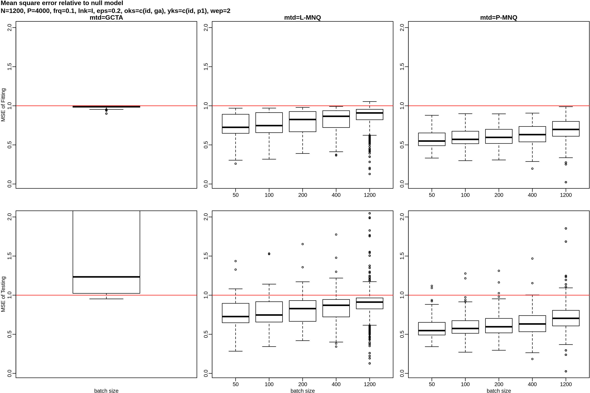

A simulation study of various methods estimating variance components.
We compare their prediction and computation performance.

***
# Simulation Settings
***

## Data Generation

### Model
We currently simulate a single response vector __$y$__ from two kernels:

$$ y = s(\eta) $$
$$ \eta \sim N(0, \Sigma) $$
$$ \Sigma = \epsilon I + \sigma^2 V $$
$$ V_{i,j} = k(G_i, G_j) $$

where the response __$y$__ was created by distorting the total effect $\eta$
via a function $s$, such that non-normality can be generated.
 
The total effect $\eta$ was drawn from a centered normal distribution with
covariance matrix $\Sigma$;

The two variance components $\epsilon$ and $\sigma^2$ weight the contribution
of white noise and genetics to the variation of __$y$__, respectively;

The genetic covariance matrix $V$ was calculated from the genome data __$G$__
via a kernel function $k$;

### Details

* Variance Components:
  + $\sigma^2 \sim uniform(0, 3)$, $\epsilon=0.2$
  + to induce heterogeneity between the training and testing data, a small
  variation N(0, 0.1) was added to the two components.

* Genome Data __$G$__:
  + downloaded from the NIH 1000 genome project, 2504 samples in total;
  + P = 4000 variants consecutively picked out from a genome region (*);
  + drop rare variants with MAF < 0.01
  + 10% of the variants were assigned with genetic effects from N(0, 1);
  + N = 1200 for both training and testing data.

* Genomic Kernels __$V$__:
  1. Linear Kernel (standardized), $V_{i,j} = \frac{1}{P} g_i^T g_j$
  2. Gaussian Kernel (standardized), $V_{i,j} = e^{\frac{||g_i - g_j||_2^2}{2P}}$
  
* Distortion __s__ on total effect $\eta$
  1. sigmoid distortion, $s(\eta) = \frac{1}{1 + e^{-\eta}}$;
  2. full period sin distortion, $s(\eta) = sin(2\pi\eta)$;
  3. a trivial non-distortion, that is, $s(\eta) = \eta$.
  
## Competing Methods

As part of the later, variance component driven meta analysis, all methods were
only allowed to see the pre-computed genomic kernel matrix __$V$__ and the already
centered response __$y$__.

### MINQUE
The current development relies on MINQUE, formally developed by [Rao 1971], which
estimate the variance components via solving a transformed linear system in closed
form instead of via gradient guided iterative approach.

A modified version was recently implemented by one of the authors [xiaoxi 2018] to
guaranteed the estimated variance components are never nagative.

Some variants are now implemented:

1. the linear MINQUE;
2. the polynomial MINQUE that apply "base expansion" at kernel level;
3. solving the variance components by batch of by the whole sample.

The combination of 2 and 3 are now expected to yield optimal performance in both
prediction accuray and computation, since previously we had demonstrated that
"polynomial" MINQUE can out-perform linear MINQUE and other competitors by a large
margin (i.e., versus REML and MLE).

For a tolerable loss of accuracy, we expect the batched training significantly
reducing the computation time due to the $O(N^3)$ complexity of inversion and eigen
decomposion involved in MINQUE.

Batched MINQUE is deviates from the of mini-batch stochastic gradient descent because
it does not involve the mechanism of iterative update.

1. start a new epoch by partition the N data points inin to N/M pieces, where M is the
   size of a batch;
2. solve MINQUE problem on all the N/M pieces, record the solution of variance component;
3. permute the N data points, go to (1), untill some stopping condition is met.
4. average all the solutions for the final, pooled solution.

### GCTA
The main competitor is GCTA-REML developed by [2012 Yang], which have undergone
continuous improvement and has become the leading tool for fast whole genomic
analysis. However, GCTA itself does not compute other than linear kernel, we
therefore wrap GCTA to allow any valid PSD kernel as input so a fair comparison
can be made.
  
***
# Comparison
***

## Scenarios

### baseline test
We use both kernels to generate data with no distortion, and allow all methods
to use the very correct kernel for development and prediction.

All methods were expected to perform well, as a proof of fair and correct use
or coding of competing methods (i.e., GCTA's REML, R's MLE, and the oracle
covariance matrix)

### Kernel mis-specification
Generate data using Gaussian kernel, without distortion, but force all methods
to develop models with a linear kernel.

### Non normal response
This time we generate total effect with linear kernel, and apply the tow types
of distortion aforementioned. We force all methods to build their model as if
the prior knowledge of distortion was unavailable.

## Benchmark

### prediction performance
For all methods, the model fitting are directly or indirectly driven by the likihood
of $__y__$. We hereby choose mean squre error of the predicted $\hat{y}$ as the
benchmark of prediction performance, since MSE was not driving the model development.
All MSE were gauged relatve to the null model that makes prediction by the averaging
$\bar{y}$.

### time for development
For GCTA, we use its reported time which excludes the creation of kernel matrices
which are indeed pre-computed. For others methods including MINQUE, the estimation of
variance components are counted as spending time.

The time are gauged relative to that consumed by GCTA.

***
# Result of Comparison
***

In this section we will show the prediction performance under the aforementioned
four scenarios, followed by the computation time under one of the scenarios since
each method and variant spent roughly the same amount of time in each simulation.

## Base line test
In short, linear kernel for response generation with no distortion, the same type
of kernel for model development.

The prediction performance is show here:

As expected, the MSE of GCTA-REML and Linear MINQUE were very close, also very close
to that of MLE (not plotted here), suggesting that the wrapping of GCTA was reliable.

Unexpected, for both training and testing data, model developed on smaller batches
showed lower MSE than larger batches and even the one built on the entire sample.

## Kernel Mis-specification
We use Gaussian kernel to generate response without distortion, use linear kernel for
model development.

In this scenario REML was inadequate, but both MINQUE variants were robust. The same
unexpected inverse association between batch size and MSE also happend again.

## Sigmoid Distortion
We use lineaer kernel to generate total effect which was in turn plugged into a sigmoid
function to get the final response variable __$y$__.

Again it show that MINQUE was robust with non normal response.

## $sin(2 \pi \eta)$ Distortion

## Time Elapsed
We selectively plotted the time performance of unchallanged baseline test. The time
spent were similar for other scenarios.

***
# Speculation
***

## performance ratting

Under chanllenge, MSE on testing data, in assending order
 * Polynomial MINQUE, batched
 * Polynomial MINQUE, Whole sample
 * Linear MINQUE, batched
 * Linear MINQUE, Whole sample
 * R's MLE implementation (not plotted)
 * REML's GCTA

The training time was, in assending order
 * Linear MINQUE, batched
 * Polynomial MINQUE, batched
 * Linear MINQUE, Whole sample
 * Polynomial MINQUE, Whole sample
 * REML's GCTA (the reference)
 * R's MLE implementation (not plotted)

## about batched MINQUE
MINQUE is not a iterative procedure, the current batched training was done by
averaging the solutions of all batches; an epoch is defined by the result
collecting from N/M batches, where N is the sample size, M is the batch size,
respectively. When an epoch is through, the N samples were shuffled and an new
epoch begins.

Here we reported the result of 2 epochs for batched MINQUE, and the unreported
performance of a single epoch is similar in terms of MSE, but spent less time.

__The batched MINQUE -- the averaging of sub-sample models may imply__
 * Logistically, Meta-analysis be a better choice than Mega-analysis if the
   participating populations are roughly homogenous.
 * a way to improvement over gradient guided iterative precedures, by averaging
   a number of models built from mini-batches, instead of going thourgh all the
   mini-batches to build just one model.

__New issues__: while the standard error of variance component estimates under $H_0$
is now implemented for a single MINQUE problem. How do we get the pooled SE for
a number of batches?
